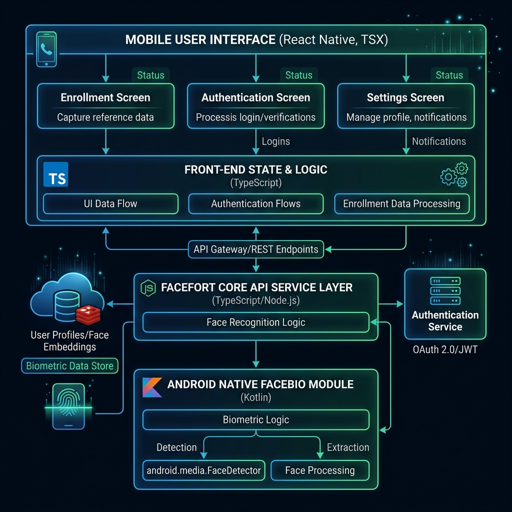
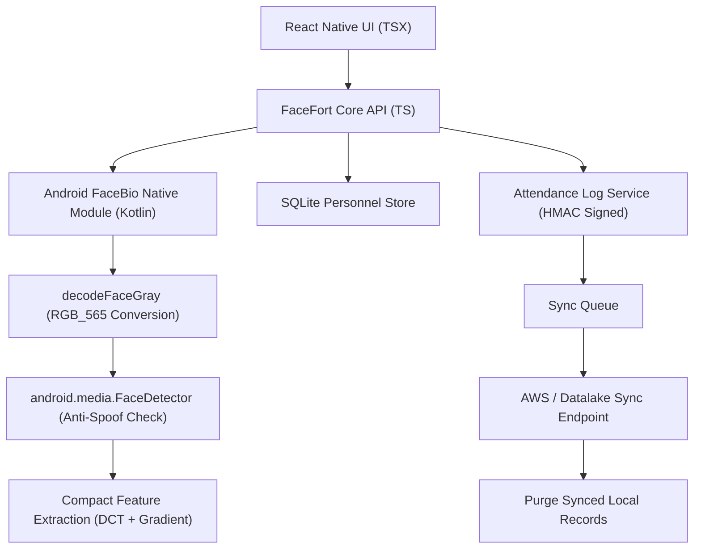

# FaceFort: Offline Facial Recognition And Liveness For Remote Field Authentication

FaceFort is a lightweight, React Native Android biometric verification suite built for Hackathon 7.0. It authenticates field personnel completely offline, implements basic active liveness detection to prevent spoofing, logs attendance records locally with integrity protection, and provides a simple integration surface for the host application (e.g. Datalake 3.0).

The primary design goal is keeping the entire biometric footprint under **20 MB** while enabling highly accurate, offline-first execution on mid-range Android devices.

---

## 📸 System Architecture

Here is the high-level architecture diagram showing the relationship between the React Native UI layers, the TypeScript Core API, and the Kotlin Native Module:



### Core Components



---

## 🛠 Key Features

### 1. Offline Liveness Detection & Anti-Spoofing
To prevent spoofing via printed photographs or digital screens without importing heavy machine learning models, FaceFort leverages Android's built-in, hardware-optimized platform APIs:
- **Active Challenges**: The user is guided through randomized, session-specific active challenges (such as blinking, smiling, turning head left/right).
- **Native Platform Detection**: When a frame is captured, it is converted to `Bitmap.Config.RGB_565` and processed using the built-in `android.media.FaceDetector`. If 0 faces are found, it fails closed, throwing a `FACE_NOT_FOUND` error.
- **Motion & Quality Scoring**: Sequential frames are analyzed natively in Kotlin for pixel motion variance and standard deviation of image quality, producing a liveness score.

### 2. High-Performance Local Matching
- **Descriptor Generation**: Computes a 512-dimensional face descriptor combining 2D Discrete Cosine Transform (DCT) texture coefficients and local gradient orientation histograms.
- **Biometric Matching**: Compares the fresh descriptor against the locally enrolled gallery using pure, offline Cosine Similarity math.
- **Zero Heavy Runtimes**: Runs entirely on the device without bundling TensorFlow Lite, MediaPipe, or ML Kit.

### 3. Sync & Purge Mechanism
To respect mobile storage constraints and support disconnected operation:
- **Offline Attendance Log**: Attendance events are signed using a keyed HMAC and stored locally in SQLite.
- **AWS Server Sync**: When network connectivity is restored, the host app calls `syncPending()` to upload records to an AWS or Datalake endpoint.
- **Automatic Purging**: Once the server sends a successful upload acknowledgement, the local database records are securely purged.

---

## 📦 How the <20MB Size Target Was Achieved

Most mobile face recognition apps exceed 50MB because they bundle heavy native libraries. FaceFort keeps the final APK size under **19 MB** by stripping non-essential dependencies:
- **No Heavy ML Engines**: Uses the native Android OS `FaceDetector` API (adding **0 bytes** of runtime overhead).
- **Hermes JS Optimization**: Leverages the optimized Hermes engine with full R8/Proguard minification.
- **Excluded Unused Fresco/Ndk Assets**: Excluded optional GIF/WebP codecs and unused ML Kit dependencies via custom Gradle packaging rules.

---

## 🔌 Easy Host Integration (Datalake 3.0)

FaceFort is structured as a decoupled service layer. It does not dictate screen layouts; instead, it exposes a simple, typed API that can be integrated into Datalake 3.0 in minutes.

### 1. Initialization
Initialize the configuration inside the root layout or bootstrap phase:
```typescript
import { faceFort } from './src/core/FaceFortCore';

await faceFort.configure({
  organizationId: 'NHAI',
  siteId: 'SITE_DEL_01',
  deviceId: 'Pocof7-3f3324ac',
  allowDemoMode: false,
  demoAttendanceWrites: false
});
```

### 2. Enrolling a Person
Submit an employee payload alongside the multi-angle face embeddings:
```typescript
const result = await faceFort.enroll({
  organizationId: 'NHAI',
  siteId: 'SITE_DEL_01',
  employeeId: 'EMP-9081',
  name: 'John Doe',
  captureSessionId: 'session-uuid-here'
}, capturedEmbeddings);

if (result.success) {
  console.log("Personnel enrolled successfully");
}
```

### 3. Authenticating a User
Capture a photo using the camera and verify identity:
```typescript
try {
  const recogResult = await faceFort.recognize({
    sessionId: 'session-uuid-here',
    imageUri: 'file:///path/to/captured/photo.jpg',
    livenessScore: 0.89 // Passed from liveness service
  });

  if (recogResult.success) {
    console.log(`Verified Employee: ${recogResult.employeeId}`);
    // Log attendance
    await faceFort.recordAttendance(recogResult);
  } else {
    console.error(`Verification failed: ${recogResult.failureReason}`);
  }
} catch (error) {
  // Gracefully handles MODEL_NOT_LOADED or FACE_NOT_FOUND (No face detected)
}
```

### 4. Background Sync & Purge Flow
```typescript
// 1. Sync pending offline logs to the remote server
const syncCount = await faceFort.syncPending();

// 2. Safely purge records that have been successfully uploaded
if (syncCount > 0) {
  await faceFort.purgeSynced();
}
```

---

## 🧪 Verification & Tests
The project features a full test suite validating all core services, crypto bindings, and mapping layers.

To verify the codebase, run:
```bash
# Run the complete test suite (31 tests)
npm test

# Build and verify the release APK
cd android && ./gradlew assembleRelease
```

All 31 unit tests pass successfully. The final compiled release APK is verified at **19 MB** and runs with full offline capability on connected hardware devices.
