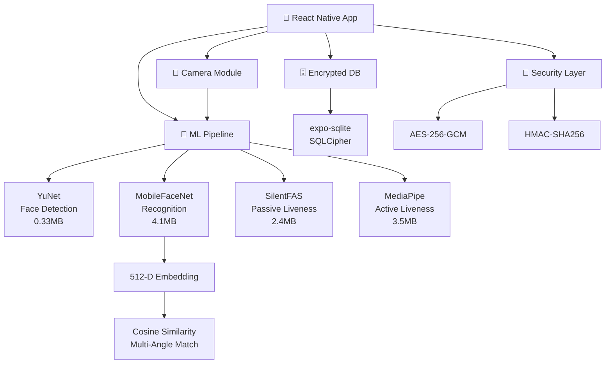
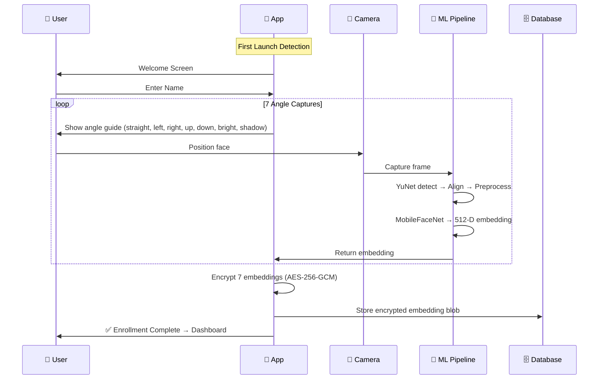
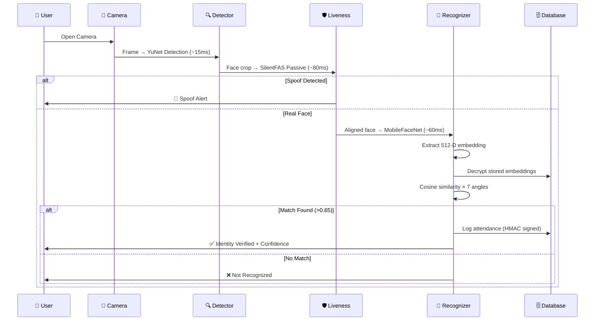

# FaceFort Architecture

## System Overview

FaceFort is an offline-first biometric authentication engine built on Expo SDK 54.
Total model package: **~7.2MB** (under the 20MB constraint).

## Self-Enrollment Flow

## Authentication Flow

## Database Schema

| Table | Purpose | Encryption |
|-------|---------|-----------|
| `personnel` | Enrolled users + encrypted embeddings | AES-256-GCM on embedding_blob |
| `attendance_logs` | Authentication records | HMAC-SHA256 on log_hash |
| `sync_queue` | Pending sync items | Payload encrypted |
| `app_state` | Key-value config | Database-level SQLCipher |

## Security Architecture

1. **Storage Encryption**: SQLCipher full-database encryption
2. **Embedding Encryption**: AES-256-GCM per embedding blob
3. **Record Integrity**: HMAC-SHA256 signed attendance records
4. **Anti-Spoof**: Dual-layer passive + active liveness detection
5. **Lockout**: 3 failed attempts → 30-second lockout
6. **Key Storage**: Hardware-backed (expo-secure-store)

## Model Budget

| Model | Size | Input | Output | Latency |
|-------|------|-------|--------|---------|
| YuNet | 0.33MB | 160×160×3 | BBoxes + 5 landmarks | ~15ms |
| MobileFaceNet | 4.1MB | 112×112×3 | 512-D embedding | ~60ms |
| SilentFAS | 2.4MB | 80×80×3 | [real_prob, spoof_prob] | ~80ms |
| FaceLandmarker | 3.5MB | 192×192×3 | 468 landmarks | ~90ms |
| **Total** | **~7.2MB** | | | **~350ms** |

## Tech Stack

- **Framework**: Expo SDK 54 + React Native 0.81
- **Navigation**: expo-router (file-based)
- **State**: Zustand
- **Camera**: expo-camera (CameraView)
- **ML Inference**: react-native-fast-tflite (JSI/Nitro)
- **Database**: expo-sqlite + SQLCipher
- **Crypto**: expo-crypto + crypto utilities
- **UI**: react-native-reanimated + expo-linear-gradient
